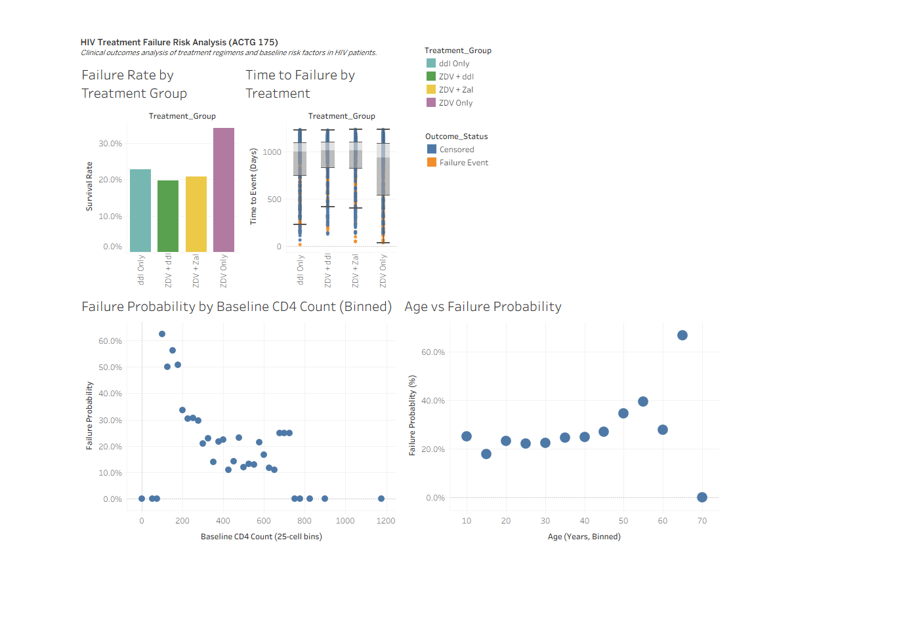

## Dashboard Preview

Clinical analytics dashboard examining HIV treatment outcomes, failure risk factors, and time-to-failure across treatment regimens.
# HIV Treatment Failure Risk Analysis (ACTG 175)

## Overview
This project analyzes HIV treatment outcomes using the ACTG 175 clinical trial dataset. The dashboard explores treatment failure risk, time-to-event distributions, and baseline risk factors including CD4 count and age.

## Live Dashboard
Tableau Public: https://public.tableau.com/app/profile/tenekua.dugan

## Key Questions
- How do treatment regimens compare in failure risk?
- How does time to failure vary across treatments?
- How do baseline CD4 count and age influence failure probability?

## Data Source
ACTG 175 clinical trial dataset from the UCI Machine Learning Repository via Kaggle.

## Methods
- Treatment groups mapped from trial arm codes
- Failure probability calculated as AVG(label)
- Time-to-event visualized using boxplots
- Risk modeling performed using binned CD4 and age distributions

## Dashboard Views
1. Failure Rate by Treatment Group  
2. Time to Event by Treatment Group  
3. CD4 Count vs Failure Probability  
4. Age vs Failure Probability  

## Skills Demonstrated
- Clinical outcomes analytics
- Time-to-event reasoning
- Risk stratification
- Data modeling in Tableau
- Binning and probability estimation
- Dashboard storytelling

## Author
Tenekua Dugan  
LinkedIn: https://www.linkedin.com/in/tenekuadugan  
Tableau Public: https://public.tableau.com/app/profile/tenekua.dugan

