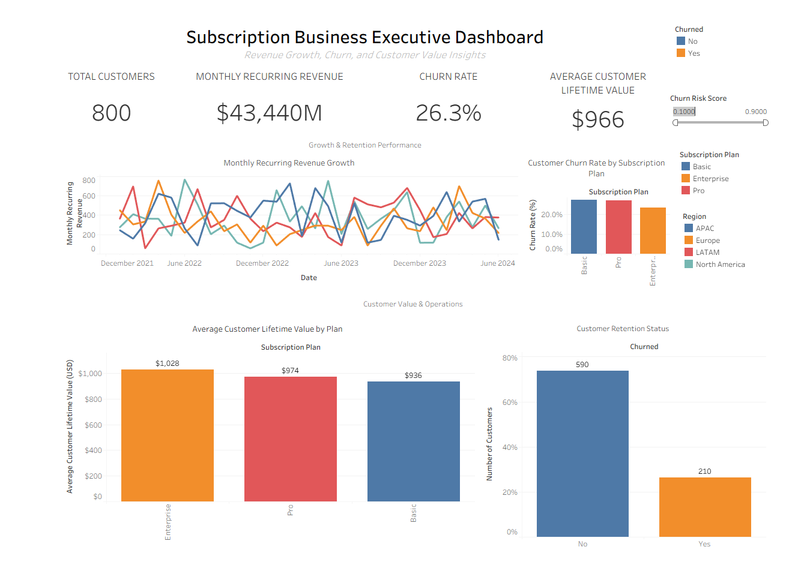

## Dashboard Preview

Business performance dashboard analyzing revenue growth, churn risk, customer lifetime value, and subscription plan dynamics.
# Subscription Business Executive Dashboard

## Revenue Growth, Churn & Customer Value Analytics

## Overview
This project presents an executive-level subscription business dashboard designed to analyze revenue performance, customer churn, and lifetime value across plans, regions, and time.

The dashboard supports data-driven decisions for growth, retention, and customer value optimization in a subscription or SaaS-style business model.

## Objectives
- Track core subscription KPIs at an executive level
- Analyze monthly recurring revenue (MRR) growth over time
- Evaluate churn rate differences by subscription plan
- Assess customer lifetime value (CLV) by plan
- Monitor customer retention status and churn risk

## Key Features
- Executive KPI cards (Customers, MRR, Churn Rate, CLV)
- Monthly recurring revenue growth trend
- Churn rate by subscription plan
- Average customer lifetime value by plan
- Customer retention status overview
- Interactive filters for plan, region, and churn risk

## Data
- Simulated subscription business dataset for demonstration purposes
- Includes customer status, revenue, churn indicators, plan type, and region

## Tools Used
- Tableau Public
- Excel (data preparation and modeling)

## Live Dashboard
Tableau Public:  
https://public.tableau.com/app/profile/tenekua.dugan

## Notes
This dashboard uses synthetic data and is intended solely for analytical and visualization portfolio demonstration purposes.
